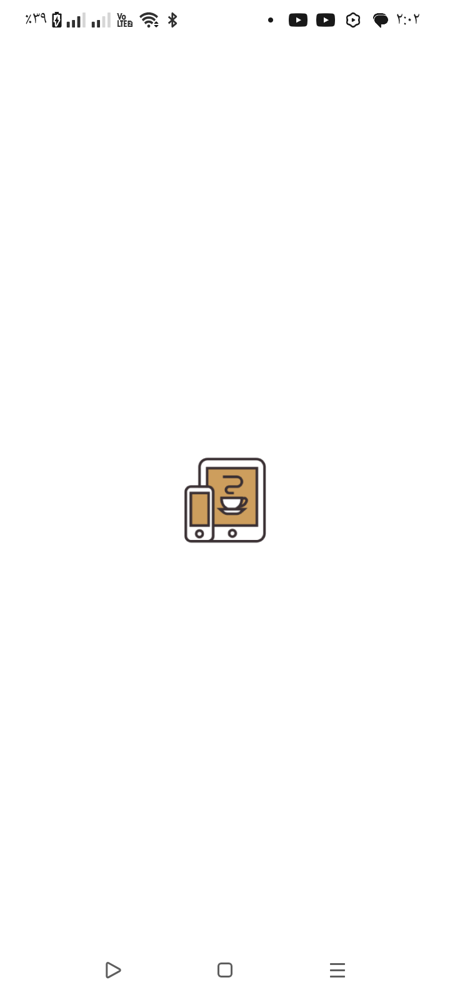
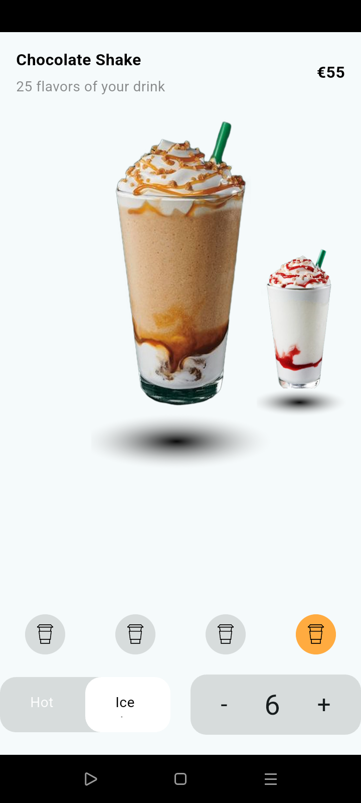

````md
# ☕ Coffee Shop App

A modern Flutter application designed to deliver a smooth and visually engaging coffee ordering experience with clean UI, responsive layouts, and interactive animations.

---

## ✨ Features

### 🚀 Splash Screen
- Adaptive splash screen 
- Optimized app launch experience
- Custom app name configuration
- Custom launcher icons

### 🍹 Drinks Section
- Animated drinks pages
- Smooth UI transitions
- Dynamic item generation using `List.generate`
- SVG asset support
- Interactive animations using `AnimatedContainer`


---

## 🛠️ Packages Used

```yaml
flutter_svg
flutter_launcher_icons
rename_app
````

---

## 📸 Screenshots

### ✨  Screen Preview

|                                                       drink list                                                      |                                                      splash screen                                                      |                                                   drink ditails                                                 |
| :---------------------------------------------------------------------------------------------------------------------: | :---------------------------------------------------------------------------------------------------------------------: | :---------------------------------------------------------------------------------------------------------------: |
|  |  |  |

---

## 🧱 Project Structure

```bash
lib/
├── core/
├── features/
├── widgets/
├── screens/
└── main.dart
```

---

## 🚀 Getting Started

Clone the project:

```bash
git clone https://github.com/MahmoodTarek/Islami.git
```

Navigate to the project directory:

```bash
cd Islami
```

Install dependencies:

```bash
flutter pub get
```

Run the app:

```bash
flutter run
```

---

## 🎯 Project Goals

* Practice clean Flutter architecture
* Build responsive and animated UI
* Improve user experience
* Learn package integration
* Create a professional Flutter project

---

## ❤️ Built With Flutter

Crafted with Flutter to create a modern and smooth coffee shop mobile experience.

```
:::
```
